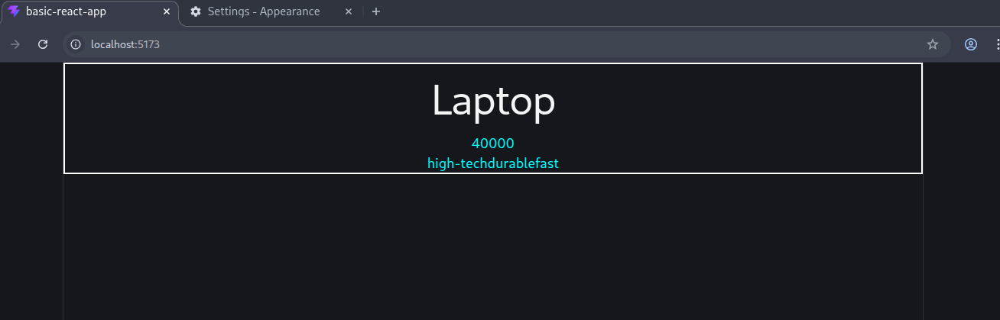

# REACT JS

What is React JS?

https://github.com/Noumansharif27/DeltaReact.git

A JS library which is use to Make UI/FrontEnd developed my Meta in 2013

> In React **Funtions** gets called while **Components** gets invoke/render.

## Component:

A component is a piece of the UI (user interface) that has its own lagic and apperance. A component can be as small as a button, or as large as an entire page.

```jsx
function MyButtom() {
	return (
		<button>I'm a buttom</button>
		);
)
```

~~as per the code above we can clearly see that React is the combination of HTML, JS and CSS~~

JSX code can never be run in a .JS file

> **Babel:** A transfiler/Compiler which converts/translates the JSX code into JS

Vite - 2020 (launched)

## Setup:

```bash
npm create vite@latest
```

<aside>
💡

1. you will be prompted to give the application a name, what technology/framework you wanna use **e.g.** VueJS, React etc …
2. What language you wanna use? Type Script? JS?
3. What Linter to use? ESLint
4. Install dependencies with npm and start the server? Yes
</aside>

In the above image we can clearly see the Boilerplate for our React application.

**Focus** on the **src** folder we have a files named: **App.jsx & main.jsx**

> App.jsx: this file is where we write our component embed it from a different file.

> Main.jsx: This file is not be messed with it renders the App.jsx into our index,html

### Import & Export

```js
import component from "./component.jsx";
```

> While importing a defaut export we can give our component a different name as well
> e.g.

```js
import component1 from "./component.jsx";
```

#### Export

```js
export default component;
```

> We use this export line when we only have once component in our file for export.

#### Name export

```js
export { component };
import { component } from "./component.jsx";
```

> We should use parenthesis when we are imorting a <b>name export<b/>.

### Markup/Rules in JSX

1. Return a single root element.

> In JSX we are supposed to return a single root element, if we have mor then one element to return then we should wrap that element in a parrent <b>Div</b>.

2. Close all tags.

> We should close all tags we use in our JSX cause when <b>Bable</b> is translating the code it looks for the closing tags and without it we would be getting errors.

3. CamelCase most of the time.

> While efining the variable or even writing some CSS attributes we should use CamelCase for that.
> e.g.

```js
<div className="parent"></div>
```

> In JavaScript the word <b>class</b> is a reserved keyword for OPPs classes, so in JSX we use className as an alternative for that matter.

### React Fragments (<></>)

Fragments lets you group a list of children without adding extra nodes to the DOM

#### e.g.

```js
return (
  <div>
    <Component0 />
    <Component1 />
  </div>
);
```

> As of our above code when it gets render we would be dealing with n extra node after our <b>Root</b>, to solve this we would use React Fragments (<></>)

```js
return (
  <>
    <Component0 />
    <Component1 />
  </>
);
```

> React Fragment is just an emptry pair of tags which works as a parent tags to group a set of tags without creating an exter nodes in or DOM.

### JSX in curly braces

> Every code written inside of the curly braces would be treated as a pure JavaScript code.
> e.g.

```js
function App() {
    let name: "Shradhs";
    return (
        <>
         <p>2 * 2 = {2 * 2}</p>
         <h4>Hi, {name}</h4>
         <p>2 * 2 = {2 * 2}</p>
         <h4>Hi, {name}</h4>
        </>
    )
```

`Create a seprate file for a component and if we have to bundle that component for repetation we should create an other file for that  bundelling then.`

### React Props:

> Props are the information that you pass to a JSX tag.

```jsx
import Product from "./Product.jsx";

function ProductTab() {
  return (
    <>
      <Product tittle="Laptop" price={40000} />
      <Product tittle="Mobile" price={30000} />
      <Product tittle="Pen" price={10} />
    </>
  );
}

export default ProductTab;
```

```jsx
import "./Product.css";

function Product(Props) {
  return (
    <div className="Product">
      <h1>{Props.tittle}</h1>
      <p>{Props.price}</p>
    </div>
  );
}

export default Product;
```

In the above example our props are treated as an object in the component file, we can use object key method to display its value.

```jsx
import "./Product.css";

function Product({ tittle, price }) {
  return (
    <div className="Product">
      <h1>{tittle}</h1>
      <p>{price}</p>
    </div>
  );
}

export default Product;
```

Now in this of code we exactly known our props and instead of using object.key method we are directly using the parameters/Props to display our dynamic values.

> As you may had noticed in props we have to use “” Quotation marks to pass down our String value while or our numbers we have to use curly braces { } for that.

### Passing Arrays & Objects to Props:

```jsx
import Product from "./Product.jsx";

function ProductTab() {
  let options = ["high-tech", "durable", "fast"];
  let options2 = { a: "high-tech", b: "durable", c: "fast" };
  return (
    <>
      <Product
        tittle="Laptop"
        price={40000}
        feature={options}
        feature2={options2}
      />
    </>
  );
}

export default ProductTab;
```

```jsx
import "./Product.css";

function Product({ tittle, price, feature, feature2 }) {
  return (
    <div className="Product">
      <h1>{tittle}</h1>
      <p>{price}</p>
      <p>{feature}</p>
      <p>{feature2.a}</p>
    </div>
  );
}

export default Product;
```

As you can see we just have to use braces to pass array or object in props, Mostly instead of defining the arrays and objects seprately before passing them we can dirrectly pass them, e.g.

```jsx
<Product
  tittle="Laptop"
  price={40000}
  feature={["hightech", "durable", "fast"]}
/>
```

`Our output would look like something like that`



`In the abve output you may see tha although we had pass our arrays individual elements in props but we can see that all the items are not seprated by commas`

### Rendering Array:

> To Render array in a different format then a long string, like we may want each of its element to be render in a un-ordered list, or as a seprate element itself, we have `2` different ways to achieve that.

> e.g.
> Instead of sending just array's value we can send array of element/array of HTML elements

```jsx
function ProductTab() {
  let options = [<li>"high-tech"</li>, <li>"durable"</li>, <li>"fast"</li>];
  return (
    <>
      <Product tittle="Laptop" price={40000} feature={options} />
    </>
  );
}

export default ProductTab;
```

> As of our above code we can see that we first convert out arrays individual elements into HTML element before sending it as a props, This method is good but here we have do to the changes manually each time for every elements which can be quite of exhausting and timetaking, now instead of doing it manually we will try `2nd method` of doing that.

```jsx
function ProductTab() {
  let options = ["high-tech", "durable", "fast"];
  let UpdatedOptions = options.map((feature) => <li>{feature}</li>);
  return (
    <>
      <Product tittle="Laptop" price={40000} feature={UpdatedOptions} />
    </>
  );
}

export default ProductTab;
```

> Now in this example we use `.map()` function of array to convert each of the array's element into an HTML element.Now instead of creating a whole new variable for that work we can directly use our method inside props which will catch the return value of our method and print it our as we wanted.

```jsx
function ProductTab() {
  let options = ["high-tech", "durable", "fast"];
  return (
    <>
      <Product tittle="Laptop" price={40000} features={options} />
    </>
  );
}

export default ProductTab;

// Inside Product.JSX file

import "./Product.css";

function Product({ tittle, price, features }) {
  return (
    <div className="Product">
      <h1>{tittle}</h1>
      <p>{price}</p>
      <p>{features.map((feature) => (
          <li>{feature}</li>
        ))}</p>
    </div>
  );
}

export default Product;

```
